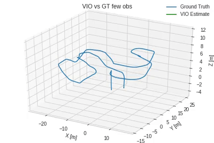

# Stereo Visual Odometry (VO) and Visual Inertial Odometry (VIO) with an Error-State Extended Kalman Filter in a quad-rotor

This repository is intended to provide complete VO and VIO pipelines for a quad-rotor. 

## Description

The system works by taking subsequent image pairs and matching features throughout the test. Once those features are obtained, 3d-points coordinates were retrieved with the depth map of the images and the extrinsic camera calibration matrix. Finally, the trajectory is estimated using 3D-2D Perspective-n-Point (PNP). As an additional step, the VO trajectory was used with the IMU data in an Error-State Extended Kalman Filter to estimate the pose even when most of the VO observations were dropped.

All the flying samples were taken from a Gazebo-based simulation with a DJI F450 model. From each flying test Grayscale, RGB and depth maps were obtained at 5 FPS. Additionally, the IMU data is provided to allow the use of the Error-State Extended Kalman Filter for Visual Intertial Odometry. Ground truth data is given to assess the performance of the pipeline.

This repository contains four python files which are:

 1. `VO.ipynb`
 2. `rotations.py`
 3. `dataset_handler.py`
 4. `vis_tools.py`

The file `rotations.py` is a class to handle rotations (quaternions) in a comprehensive way. Similarly, `dataset_handler.py` store the images in lists and synchronize time-stamps with the IMU data for sensor fusion. Finally, `vis_tools.py` contains all the methods related with plotting and visualization.

`VO.ipynb` has the whole implementation of the VO and VIO pipelines besides the concepts needed to implement this system. Furthermore, the bibliographic resources are given there.   

Below is given a set of images stores in the flying test. From left to right, Grayscale image, RGB image and Depth map for the same time-stamp.

    

**Note**: Only one flying test is provided owing to the size (around 5GB) of the files. If you want to download this repository please be patient. 

## Requirements

The following list provides the minimum requirements to run the project.

    matplotlib >= 3.0.3
    cv2 >= 3.4.0
    numpy >= 1.16.2
    pandas >= 0.23.0

## Usage

To run the system, just use Jupyter Notebook and run the cells. 

    jupyter-notebook

The content of the Notebook is arranged as follows:

 - Loading dataframes
 - 3D Geometry and reference frames
 - Loading the dataset
 - Visual odometry and results
 - Visual inertial odometry and results
 - Dropping VO observations to assess robustness of ESKF

## Results

The next animations and images present the results of the system over a complex trajectory.  The animations presented are: VO with all observations, VIO with all observations, VO with only the 15% of the total observations, VIO with only the 15% of the total observations.

      

Additionally, the following plots show how VIO techniques are capable to accurately estimate the position of the quad-rotor throughout the trajectory.

   

   

 